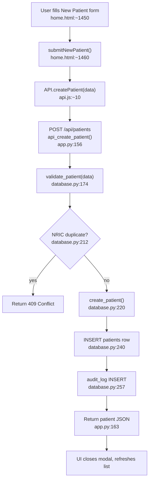
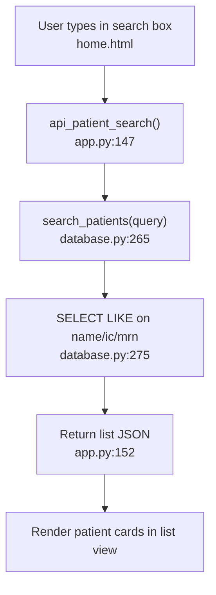
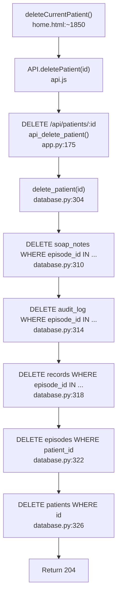

# F1 — Patient Registry

## Happy Path: Create Patient

## Happy Path: Search Patient

## Delete Patient (cascade)

## External Dependencies

- F2 Episode Management: `api_patient_episodes()` called from patient detail view
- F10 Dashboard: `search_patients()` also feeds active patient list

## Known Issues

- `update_patient()` (database.py:333) has NO duplicate NRIC check on edit — a patient can be updated to an NRIC already belonging to another record
- `_openPatientInline(id)` in home.html — dead code not yet removed
