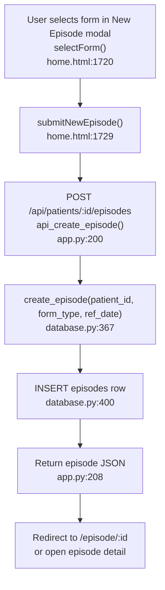
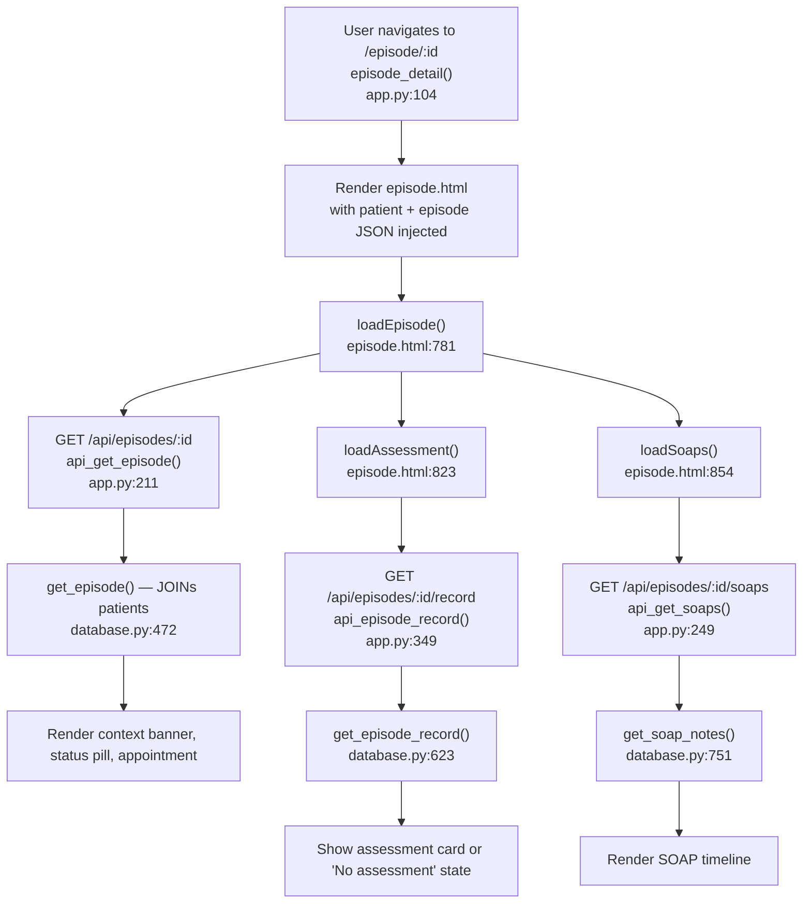
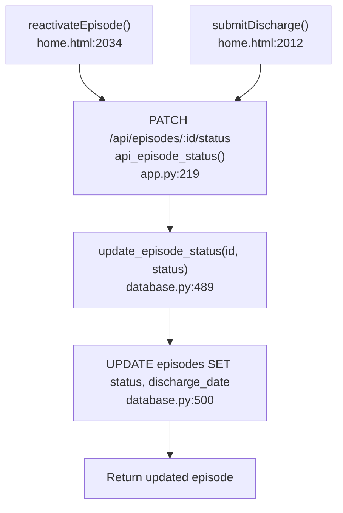
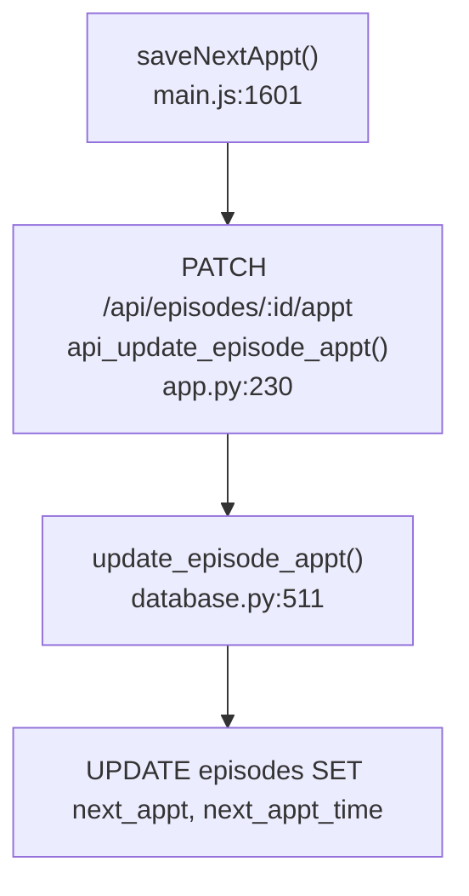

# F2 — Episode Management

## Happy Path: Create Episode



## Episode Detail Load



## Discharge / Reactivate



## Next Appointment Update



## form_type Propagation

```
create_episode stores form_type in episodes row
  → /form/<form_type> link on episode detail
  → _PDF_GENERATORS[form_type] at export time
  → MPIS copyToMpisAuto normalizes with .toUpperCase()
```

## External Dependencies

- F1 Patient Registry: `get_patient()` JOINed in `get_episode()`
- F3 Assessment Form Entry: assessment card reads record from F3
- F4 SOAP Notes: SOAP timeline rendered alongside episode
- F8 PDF Export: export button on episode detail
