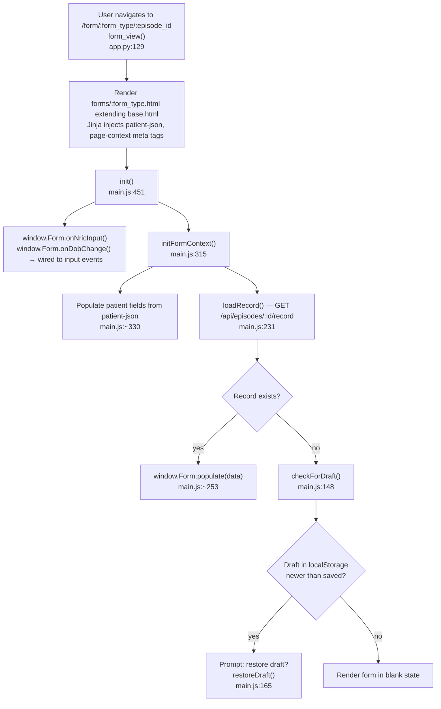
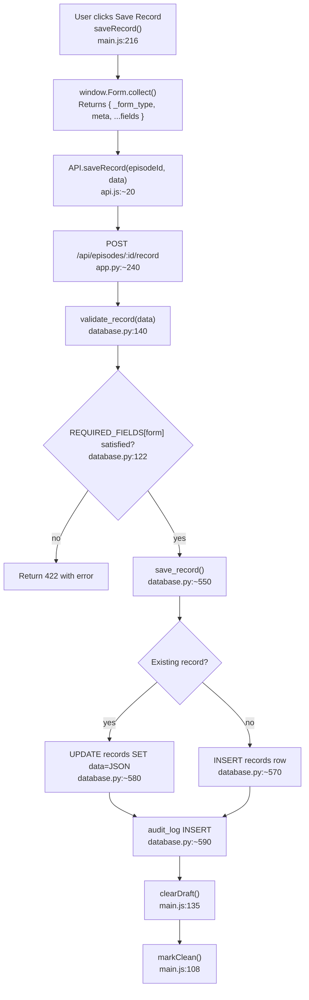
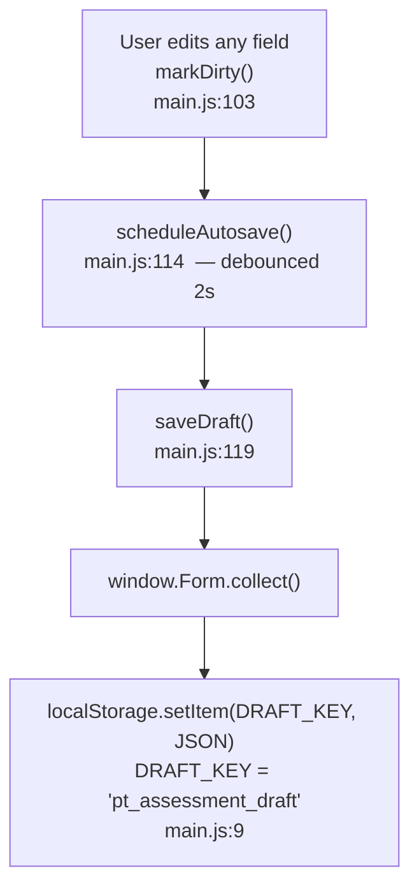

# F3 — Assessment Form Entry

## Form Init / Page Load



## Save Record



## Autosave / Draft



## REQUIRED_FIELDS per form (database.py:122–134)

| Form | Required |
|------|----------|
| common | name, date |
| MS / SPINE / GERIATRIC / CR / NEURO | + diagnosis |
| HAND | + diagnosis, pt_impression |
| AMPUTATION | + impression |

## validate_record form_type resolution

`data['meta']['form']` at database.py:140 — NOT `data['_form_type']`.
`_form_type` is used only for PDF routing dispatch.

## window.Form contract (form_hand.js:398–406 as example)

```js
window.ActiveForm = HandForm;
window.Form = {
  collect: HandForm.collect,
  populate: HandForm.populate,
  reset: HandForm.reset,
  onPtTypeChange: FormBase.onPtTypeChange,
  onNricInput: FormBase.onNricInput,
  onDobChange: FormBase.onDobChange
}
```

Missing any of these = silent crash in main.js init().

## External Dependencies

- F5 Interactive Diagram Widgets: widgets called inside `collect()` (BodyChart.getData(), HandChart.getData(), LungChart.getData())
- F6 Dynamic Clinical Tables: tables called inside `collect()` (MovementTable.getData(), MmtTable.getData(), InvMedTable.getData())
- F8 PDF Export: exportPdf() at main.js:970 calls same record data
- F9 Clinical Templates: template buttons inject text into textareas
