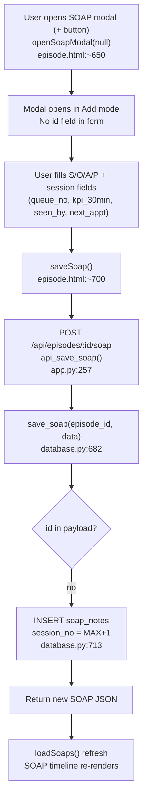
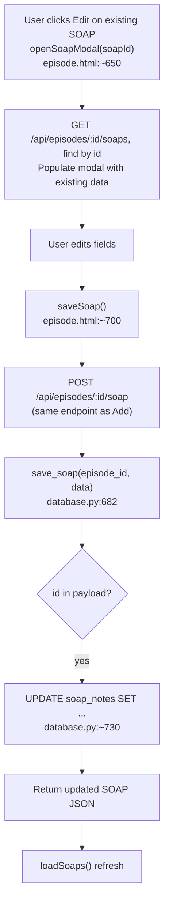
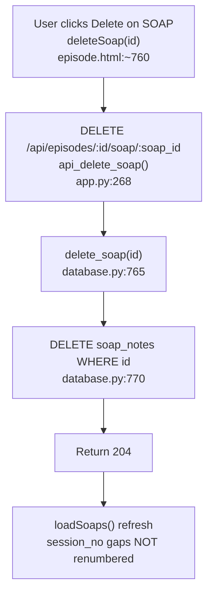
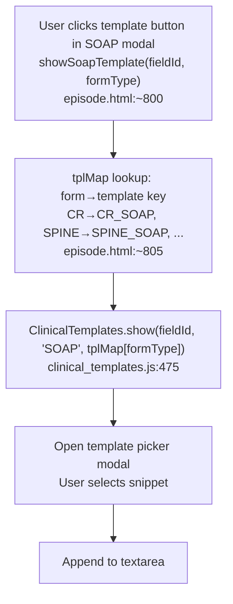

# F4 — SOAP Follow-Up Notes

## Add SOAP Note

## Edit SOAP Note

## Delete SOAP Note

## SOAP Template (O button for AMPUTATION only)

## session_no Behavior

- Assigned at INSERT: `SELECT COALESCE(MAX(session_no), 0) + 1` (database.py:713–717)
- Deleting a SOAP note leaves a gap — sessions 1,2,3 → delete 2 → sessions 1,3
- No renumbering after delete (intentional — audit integrity)

## Objective Template Visibility

- O (Objective) template button shown ONLY for AMPUTATION form (episode.html:644–648)
- All other forms: only S/A/P template buttons visible

## External Dependencies

- F2 Episode Management: SOAP notes displayed in episode detail timeline
- F7 MPIS Copy: `copySOAPtoMpis()` in episode.html:721 reads SOAP fields directly from DOM (standalone, no Main.* dependency)
- F9 Clinical Templates: `ClinicalTemplates.show()` used for per-form SOAP snippets
