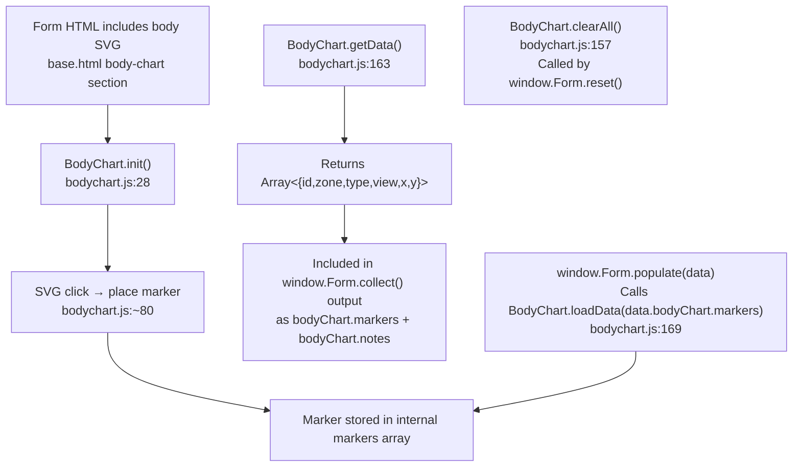
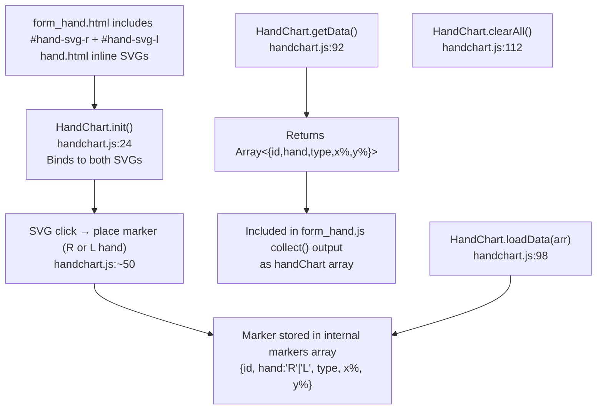
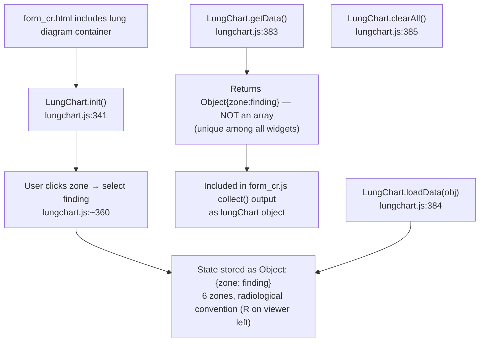

# F5 — Interactive Diagram Widgets

## BodyChart

## HandChart

## LungChart

## Widget Return Type Summary

| Widget | getData() return type | Key |
|--------|----------------------|-----|
| BodyChart | `Array<{id,zone,type,view,x,y}>` | `bodyChart.markers` |
| HandChart | `Array<{id,hand,type,x%,y%}>` | `handChart` |
| LungChart | `Object{zone:finding}` | `lungChart` |

## FINDING_COLORS consistency

All 5 hex values identical between `lungchart.js:8–14` and `pdf_cr.py:26–32`.
No drift. Must be kept in sync manually when either file changes.

## External Dependencies

- F3 Assessment Form Entry: all three widgets called inside `collect()` / `populate()` / `reset()` of the relevant form_xxx.js
- F8 PDF Export: widget data serialized to JSON in record; `pdf_cr.py` reads `lungChart` object, `pdf_*.py` read `bodyChart`
