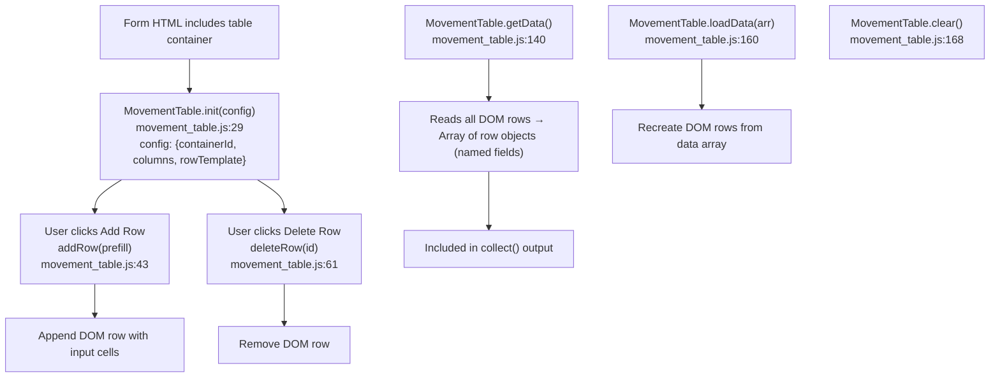
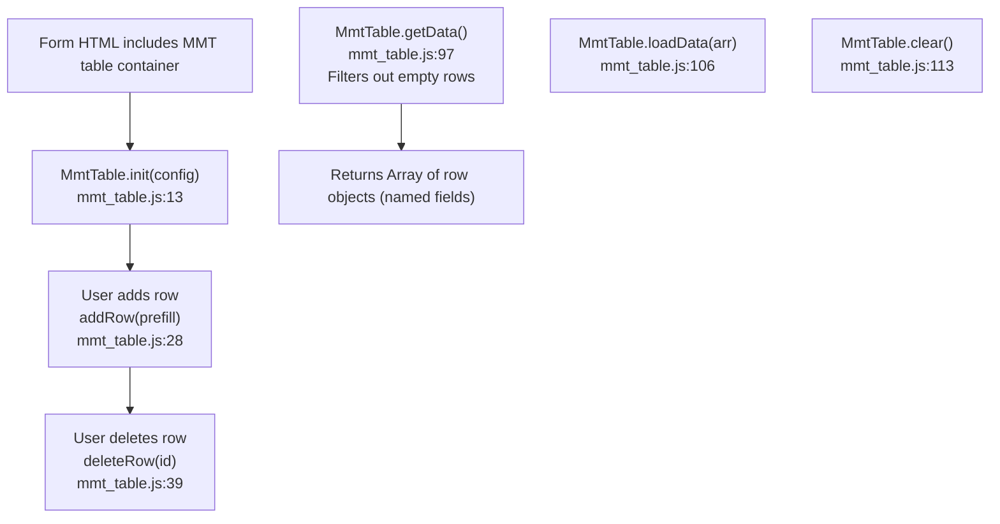
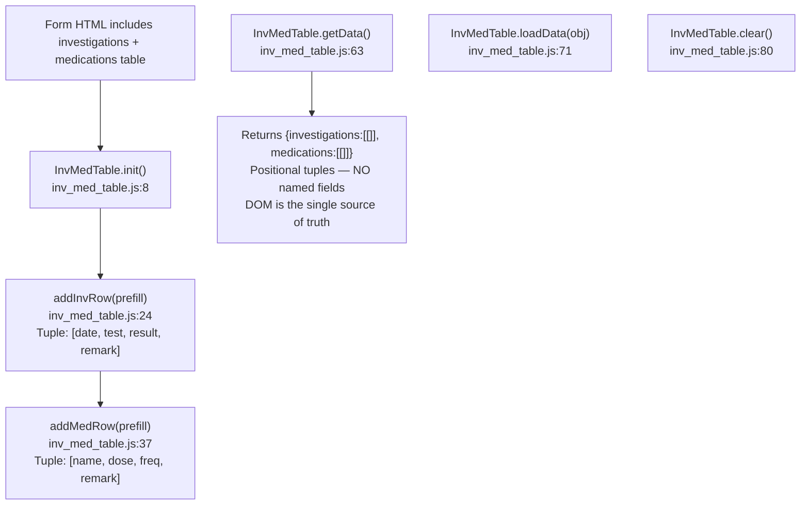

# F6 — Dynamic Clinical Tables

## MovementTable

## MmtTable

## InvMedTable

## Table Return Type Comparison

| Table | getData() structure | Field access |
|-------|-------------------|--------------|
| MovementTable | `Array<{movement, active, passive, ...}>` | named fields |
| MmtTable | `Array<{muscle, left, right, ...}>` | named fields |
| InvMedTable | `{investigations:[[date,test,result,remark]], medications:[[name,dose,freq,remark]]}` | positional index |

InvMedTable is the outlier — positional tuples with no field names. PDF generators must know the index positions.

## External Dependencies

- F3 Assessment Form Entry: all tables called inside relevant form_xxx.js `collect()` / `populate()` / `reset()`
- F8 PDF Export: table data read from serialized JSON record in each `pdf_*.py`
