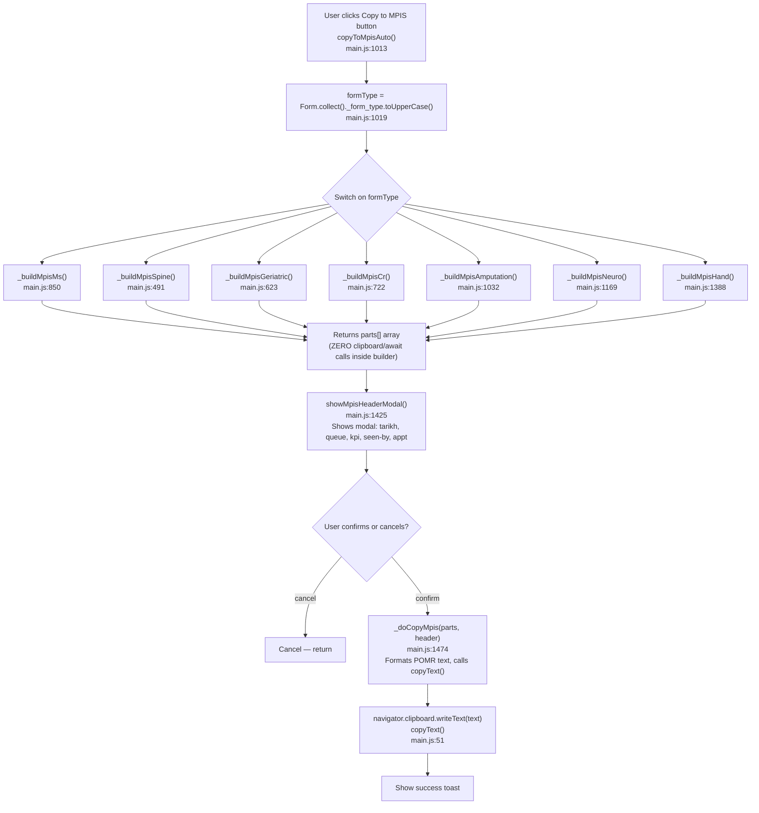
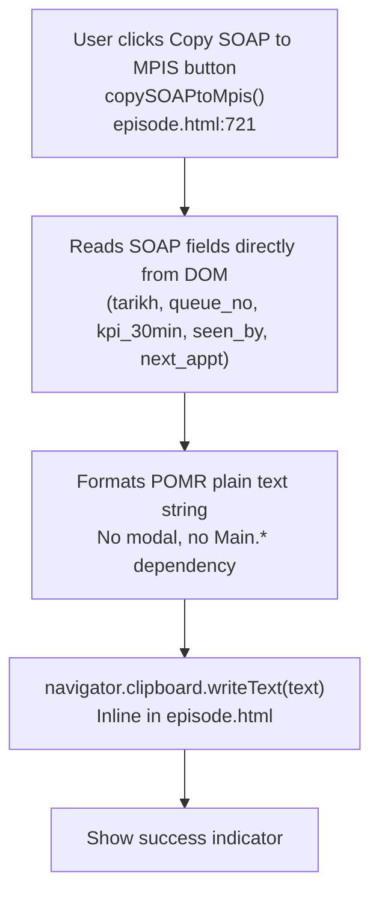

# F7 — MPIS Copy-to-Clipboard

## Assessment MPIS (main.js pattern)



## SOAP MPIS (episode.html, standalone)



## Legacy Per-Form Wrappers (main.js:1499–1505)

```js
// These all exist but are REDUNDANT — copyToMpisAuto() handles dispatch
async function copyToMpisSpine()     { ... }  // main.js:1499
async function copyToMpisGeriatric() { ... }  // main.js:1500
async function copyToMpisCr()        { ... }  // main.js:1501
async function copyToMpis()          { ... }  // main.js:1502 (MS)
async function copyToMpisAmputation(){ ... }  // main.js:1503
async function copyToMpisNeuro()     { ... }  // main.js:1504
async function copyToMpisHand()      { ... }  // main.js:1505
```

These call their respective builders + `_doCopyMpis()` directly. Not called from any HTML. Exist alongside `copyToMpisAuto()`. Duplication candidate.

## POMR Format

```
TARIKH: <date>
NOMBOR GILIRAN: <queue>
KPI-SS-30 MINIT: <kpi>
DILIHAT: <seen_by>
---
[content blocks via mpisSec()]
---
TEMUJANJI: <next_appt>
```

## XSS

User-supplied strings (patient name, dates, form type) must pass through `escapeHtml()` before innerHTML injection. Clipboard copy path uses text (safe), but modal display path requires escaping.

## External Dependencies

- F3 Assessment Form Entry: `window.Form.collect()` called to gather form data
- F4 SOAP Notes: `copySOAPtoMpis()` reads episode.html SOAP modal DOM (standalone, no F3/F7 dependency)
