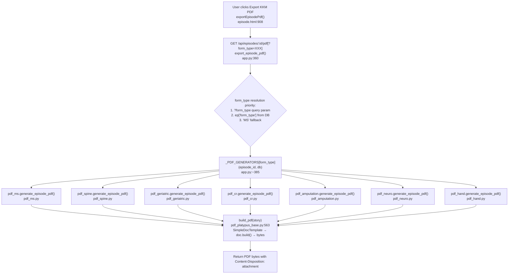
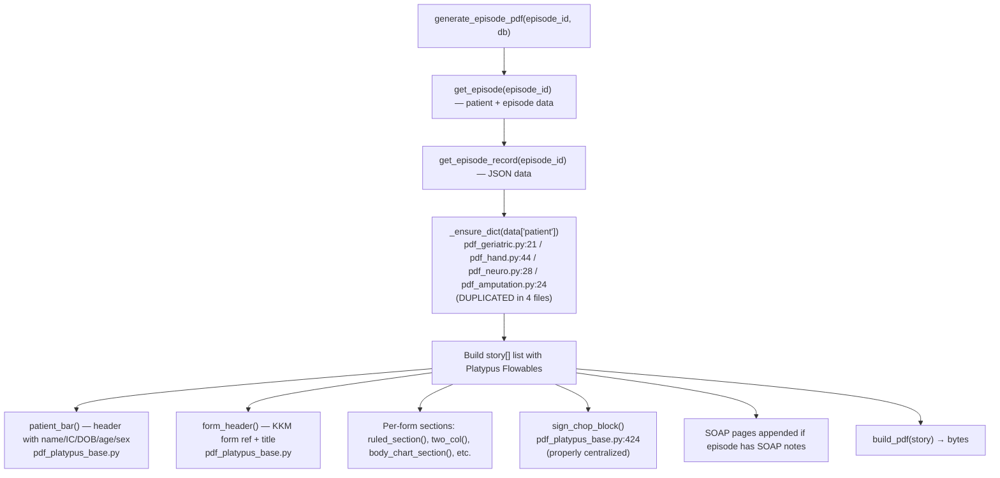

# F8 — PDF Export

## Episode PDF Export



## Single Record PDF Export

```mermaid
flowchart TD
    A["API.exportPdf(recordId, formType)<br/>api.js:36"]
    B["GET /api/export/:record_id/pdf[?form_type=XXX]<br/>export_pdf()<br/>app.py:398"]
    C{"form_type resolution priority:<br/>1. ?form_type query param<br/>2. data['_form_type']<br/>3. data['meta']['form']<br/>4. 'MS' fallback"}
    D["_SINGLE_PDF_GENERATORS[form_type](record_id, db)"]
    E["Same per-form generator functions<br/>generate_<form>_pdf()"]
    F["build_pdf(story) → bytes"]
    G["Return PDF"]

    A --> B --> C --> D --> E --> F --> G
```



## Per-Form PDF Generator Structure



## PDF Routing Registries (must both be updated per new form)

```
_PDF_GENERATORS (app.py) — episode export:
  MS → pdf_ms.generate_episode_pdf
  SPINE → pdf_spine.generate_episode_pdf
  GERIATRIC → pdf_geriatric.generate_episode_pdf
  CR → pdf_cr.generate_episode_pdf
  AMPUTATION → pdf_amputation.generate_episode_pdf
  NEURO → pdf_neuro.generate_episode_pdf
  HAND → pdf_hand.generate_episode_pdf

_SINGLE_PDF_GENERATORS (app.py) — single record:
  MS → pdf_ms.generate_ms_pdf
  SPINE → pdf_spine.generate_spine_pdf
  ... (same 7 forms)
```

## Dead / Legacy

- `pdf_generator.py` — NOT in any dispatch dict, NOT imported in app.py. Still bundled in `pt_assessment.spec:12`. Dead code.
- `pdf_base.py` — ALIVE: imported by `pdf_platypus_base.py:54` via try/except for `BodyChartFlowable`. Not dead.

## External Dependencies

- F2 Episode Management: episode record + patient data fetched from DB
- F5 Diagram Widgets: widget data (bodyChart, handChart, lungChart) read from serialized JSON
- F6 Dynamic Tables: table data (movements, MMT, inv/med) read from serialized JSON
