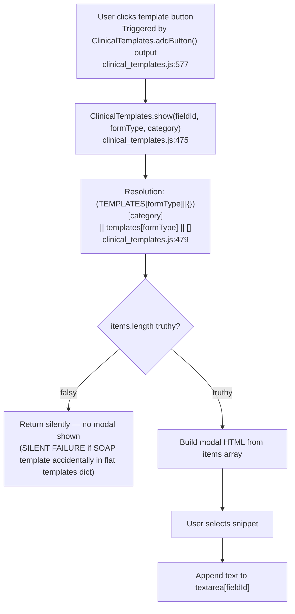
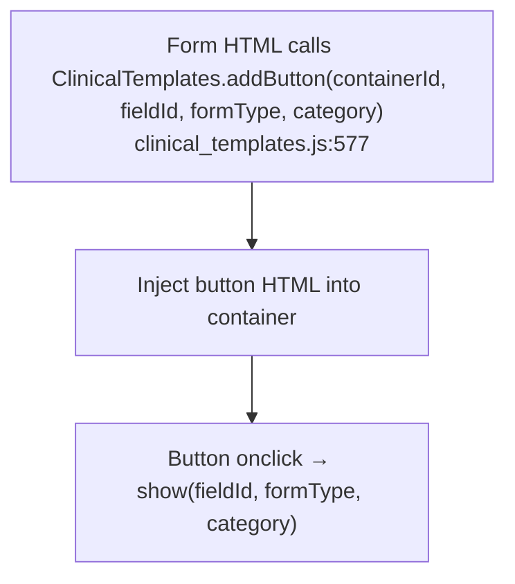

# F9 — Clinical Templates

## Show Template Modal



## addButton() Wiring



## Template Storage Architecture

```
clinical_templates.js IIFE
│
├── TEMPLATES (const, top of IIFE) — SOAP dicts + assessment dicts for some forms
│   Keys: MS, SPINE, GERIATRIC, CR, NEURO,
│         MS_SOAP, CR_SOAP, SPINE_SOAP, GERIATRIC_SOAP,
│         AMPUTATION, AMPUTATION_SOAP, NEURO_SOAP, HAND_SOAP
│   Structure: { category: { subcategory: "text" } }  (nested dicts for SOAP)
│              { category: ["snippet1", "snippet2"] }  (arrays for assessment)
│
└── templates (flat dict, lower in IIFE) — assessment arrays for HAND only
    Keys: HAND_OBS, HAND_PALP, HAND_IMPRESSION, HAND_STG, HAND_LTG, HAND_PLAN
    Structure: { formType: ["snippet1", "snippet2"] }
```

## Resolution Logic (clinical_templates.js:479)

```js
var items = (TEMPLATES[formType] || {})[category] || templates[formType] || [];
if (!items.length) return;  // line 480
```

- Plain objects (`{}`) have `undefined` length → `!undefined === true` → silent return
- **If a SOAP template dict is placed in flat `templates` instead of `TEMPLATES`**: `items = { subcategory: "text" }` → `items.length === undefined` → silent return. No modal, no error.
- Assessment template arrays have `.length` → work correctly from either location
- This is the HAND_SOAP bug that was found and fixed in a previous session

## tplMap in episode.html showSoapTemplate()

```js
var tplMap = {
  CR: 'CR_SOAP', SPINE: 'SPINE_SOAP', GERIATRIC: 'GERIATRIC_SOAP',
  AMPUTATION: 'AMPUTATION_SOAP', NEURO: 'NEURO_SOAP', HAND: 'HAND_SOAP'
};
// default → MS_SOAP
```

## Known Stale Comment

`clinical_templates.js` line 4 comment lists only MS/SPINE/GERIATRIC/CR — does not include HAND/AMPUTATION/NEURO. Stale since those forms were added.

## External Dependencies

- F3 Assessment Form Entry: `addButton()` called from form HTML to inject template buttons into form sections
- F4 SOAP Notes: `show()` called from `showSoapTemplate()` in episode.html for SOAP-level templates
