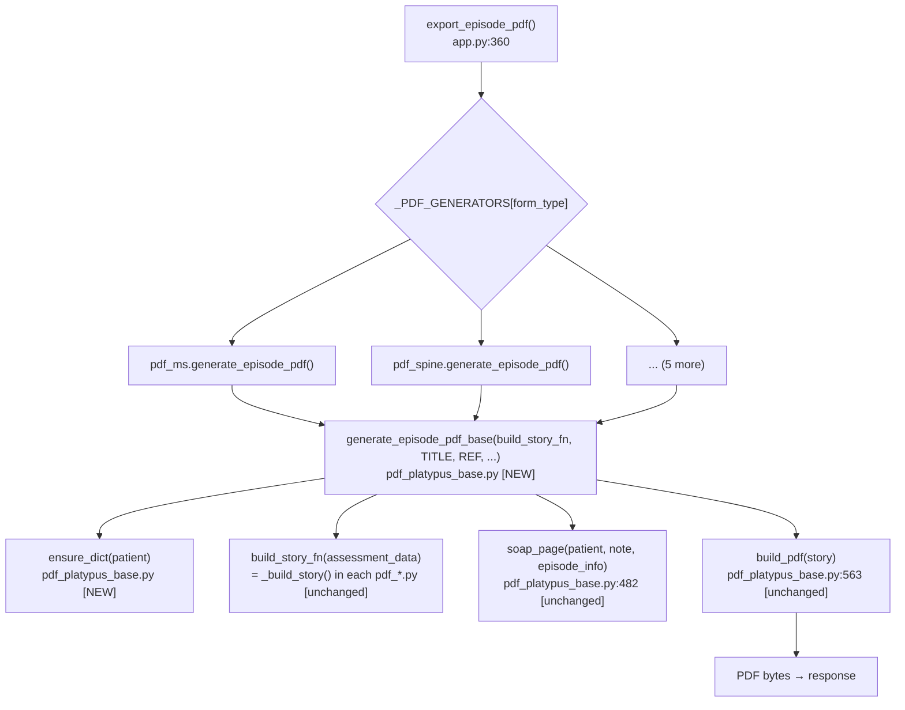

# PT Assessment System — Unified Architecture Proposal

**Phase 3. Orchestrator synthesis only. Current state described in 02-duplication-report.md.**

---

## What to fix and what to leave alone

Two duplications are worth fixing (D1, D2). Five are dead code cleanups (D3–D7). Nothing else warrants architectural change — the rest of the system is already well-structured.

---

## U1 — Centralize `_ensure_dict()` in `pdf_platypus_base.py`

**Current state:** 4 files each define the same 7-line function locally.

**Proposed:** One definition in `pdf_platypus_base.py`, exported alongside `patient_bar`, `soap_page`, `sign_chop_block`.

```python
# pdf_platypus_base.py — add near top, after imports
def ensure_dict(val):
    """Coerce a SQLite JSON string (or None, or already-dict) to a dict."""
    if isinstance(val, str):
        try:
            import json
            return json.loads(val)
        except Exception:
            return {}
    return val if isinstance(val, dict) else {}
```

**What each call site becomes:**

| Old call | New call |
|----------|----------|
| `pdf_geriatric.py:30` `_ensure_dict(d.get('patient'))` | `ensure_dict(d.get('patient'))` (import from base) |
| `pdf_hand.py:128` `_ensure_dict(data.get('patient', {}))` | same |
| `pdf_neuro.py:47` `_ensure_dict(d.get('patient'))` | same |
| `pdf_amputation.py:33` `_ensure_dict(d.get('bodyChart') or ...)` | same |
| `pdf_ms.py:~156` bare `.get('patient', {})` | wrap in `ensure_dict()` to close latent bug |
| `pdf_spine.py` same | same |
| `pdf_cr.py` same | same |

**What gets deleted:** The 4 local `_ensure_dict` definitions. The nested `import json as _json` inside `_build_story()` in neuro and amputation.

**Loss of capability:** None.

---

## U2 — Extract `generate_episode_pdf()` boilerplate into `pdf_platypus_base.py`

**Current state:** 18 nearly-identical lines in all 7 PDF generators.

**Proposed:** One shared function in `pdf_platypus_base.py`:

```python
def generate_episode_pdf_base(build_story_fn, title, ref, assessment_data, soap_notes, episode_info=None):
    """Shared episode PDF assembly: assessment story + paginated SOAP notes."""
    story   = []
    patient = ensure_dict((assessment_data or {}).get('patient', {}))

    if assessment_data:
        story += build_story_fn(assessment_data)
    else:
        story += page_header(title, ref)
        story.append(Paragraph('No initial assessment recorded for this episode.', S_NORMAL))

    notes = soap_notes or []
    for i in range(0, len(notes), 2):
        story.append(PageBreak())
        pair = []
        pair += soap_page(patient, notes[i], episode_info)
        if i + 1 < len(notes):
            pair += soap_page(patient, notes[i + 1], episode_info)
        story.append(KeepTogether(pair))

    return build_pdf(story)
```

**What each call site becomes (all 7 files):**

```python
# Before (18 lines in each file):
def generate_episode_pdf(assessment_data, soap_notes, episode_info=None):
    story = []
    patient = (assessment_data or {}).get('patient', {})
    ... [14 more lines] ...
    return build_pdf(story)

# After (1 line in each file):
def generate_episode_pdf(assessment_data, soap_notes, episode_info=None):
    return generate_episode_pdf_base(_build_story, TITLE, REF, assessment_data, soap_notes, episode_info)
```

**Import change per file:** Add `generate_episode_pdf_base` to the existing import from `pdf_platypus_base`.

**Dependency:** U2 depends on U1 — the base function uses `ensure_dict()` which must exist first.

**Loss of capability:** None. `pdf_hand.py`'s `_ensure_dict` call on patient is now handled by the base function for all forms, which is strictly better.

---

## U3 — Delete dead per-form MPIS wrappers from `main.js`

**Current state:** 7 one-liner wrapper functions (main.js:1499–1509) exported in Main API but never called from HTML.

**Proposed:** Delete the 7 functions. Remove from the Main return object (lines 1650–1656).

**What gets deleted:**
- `copyToMpis()` (MS, line 1502)
- `copyToMpisSpine()` (1499)
- `copyToMpisGeriatric()` (1500)
- `copyToMpisCr()` (1501)
- `copyToMpisAmputation()` (1503)
- `copyToMpisNeuro()` (1504)
- `copyToMpisHand()` (1505–1509)

**Caller audit:** `base.html:131` calls `Main.copyToMpisAuto()` only. No template calls any per-form wrapper. Safe to delete.

**Loss of capability:** None — `copyToMpisAuto()` already handles all dispatch.

---

## U4 — Delete dead files

| File | Action |
|------|--------|
| `static/js/form.js` | Delete file |
| `pdf_generator.py` | Delete file, remove from `pt_assessment.spec` datas |
| `pdf_amputation.py:341` | Remove orphaned comment line |

`form.js` is not in `pt_assessment.spec` (confirmed — not bundled), so no spec change needed for it.

---

## What NOT to change

- **`form_hand.js` gv/sv helpers (D6)** — cosmetically inconsistent but functionally identical. Not worth a PR by itself. Fix opportunistically if touching `form_hand.js` for another reason.
- **LungChart color constants** — cross-language, cannot share. Document the sync requirement (already in F5 flowchart).
- **`audit_log` pattern in database.py** — three different operations, already correct. No change.
- **`window.Form` contract** — required API surface, not duplication.

---

## Combined Mermaid: Unified PDF Generation Path



---

## Implementation Order

1. **U1 first** — add `ensure_dict` to `pdf_platypus_base.py`. Low risk, standalone.
2. **U2 second** — depends on U1. Add `generate_episode_pdf_base` and update all 7 call sites.
3. **U3** — independent. Delete MPIS wrappers.
4. **U4** — independent. Delete dead files.

U1+U2 together: ~30 lines added to pdf_platypus_base.py, ~120 lines deleted across 7 pdf files. Net: -90 lines.
U3: ~20 lines deleted.
U4: ~600 lines deleted (2 dead files).

**Total net reduction: ~730 lines.**
